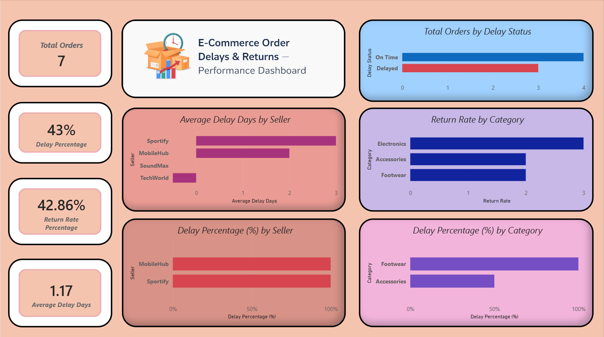

# 🚚 E-Commerce Order Delays & Returns Analysis

A practical analytics project focused on **order fulfillment delays and return behavior** in an e-commerce business.  
This project simulates how data analysts support **operations, logistics, and seller performance teams** using SQL and Power BI.

---

## 📌 Problem Statement

Late deliveries and frequent returns directly impact **customer satisfaction, operational cost, and seller accountability**.

This project answers:
- Why are orders getting delayed?
- Which sellers and categories contribute most to delays?
- How often are delayed orders being returned?
- Where should operations teams intervene first?

---

## 📊 Dashboard Snapshot



---

## 🔍 What This Analysis Covers

- Delivery performance tracking
- Delay classification (On-Time vs Delayed)
- Seller-wise delay accountability
- Category-wise return behavior
- Average delivery delay duration

The output is a **decision-support dashboard**, not just charts.

---

## 🎯 Business Use Cases

This dashboard can be used by:
- Operations Managers → Monitor delivery efficiency
- Supply Chain Teams → Identify weak sellers
- Category Managers → Reduce returns
- Leadership → Track fulfillment KPIs

---

## 📈 Metrics Tracked

| Metric | Purpose |
|------|--------|
| Total Orders | Overall order volume |
| Delay Percentage | Fulfillment efficiency |
| Return Rate % | Customer dissatisfaction indicator |
| Average Delay Days | Severity of delivery issues |
| Delays by Seller | Seller accountability |
| Delays by Category | Product-level issues |
| Returns by Category | Quality & expectation gaps |

---

## 🗂 Data Overview

**Data Type:** Simulated e-commerce transactions  
**Level:** Order-level  

### Included Entities:
- Customers (location data)
- Products (category & seller)
- Orders (dates, status)
- Returns (reason & flags)

📁 Cleaned dataset is available in the `Data/` folder.

---

## 🧮 Data Preparation Approach (SQL)

SQL was used **only where it adds business value**, including:

- Combining orders, customers, products, and returns
- Calculating delivery delay days
- Creating delay status flags
- Identifying returned vs non-returned orders
- Producing a single flat dataset for BI analysis

📁 SQL logic is documented in the `SQL/` file.

---

## 📊 Power BI Dashboard Design

The dashboard is structured into:

### 1️⃣ Overview KPIs  
- Total Orders  
- Delay %  
- Return Rate %  
- Avg Delay Days  

### 2️⃣ Delay Analysis  
- On-Time vs Delayed Orders  
- Delay % by Seller  
- Delay % by Category  

### 3️⃣ Return Analysis  
- Return Rate by Category  
- Relationship between delays and returns  

The layout prioritizes **quick decision-making**.

---

## 🗃 Repository Structure
```
E-Commerce-Order-Delays-Returns-Analysis/
│
├── Data/
│ └── order_delay_returns_dataset.csv
│
├── SQL/
│ └── order_delay_analysis.sql
│
├── Screenshots/
│ └── Dashboard.png
│
├── E-Commerce_Order_Delay_Returns.pbix
└── README.md
```

## 📐 Core DAX Logic

- Order counts
- Delay percentage calculation
- Return rate calculation
- Average delay duration

DAX is kept **simple, readable, and interview-friendly**.

---

## 🛠 Tech Stack

- **SQL** – Data modeling & transformation
- **Excel** – SQL output validation
- **Power BI** – Visualization & analysis
- **DAX** – KPI calculations
- **GitHub** – Project documentation

---

## 🎓 Key Takeaways

- Learned how operational KPIs differ from customer support KPIs
- Translated raw order data into business insights
- Practiced real-world delay & return logic
- Built a dashboard aligned with operations teams
- Strengthened SQL → BI workflow understanding

---

## 👤 About the Author

**Rajat Bhaskar**  
Aspiring Data Analyst  
📍 India  
🔗 GitHub: https://github.com/Rajat-Bhaskar

